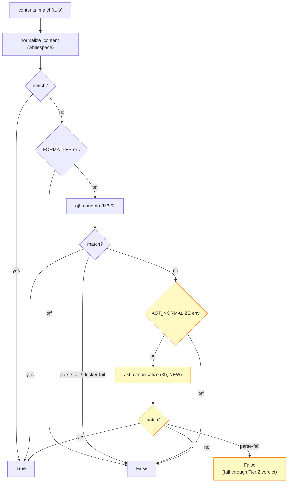

# Plan: Comparator option 3b — AST-aware normalize (Tier C scope)

**Status:** implemented partially — phases 3b.0–3b.4 shipped 2026-05-14; **§3 pause trigger fired** (recovery X=5 vs floor X≥30); 3b.5 doc-finalisation completed in stop-and-document mode; ISSUES.md #2 stays `decided`, NOT `resolved`. Empirical outcome in §13.
**Owner:** Ali
**Created:** 2026-05-14
**Depends on:** M3.5 ([`comparator.py::contents_match`](../../merge-tool-comparison/src/evaluation/comparator.py) two-tier shipped; [`docker/google-java-format/Dockerfile`](../../merge-tool-comparison/docker/google-java-format/) built)
**Closes:** [`ISSUES.md` #2](../../merge-tool-comparison/ISSUES.md) (target: `decided → resolved`)
**Related:** [`mergiraf-integration.md §Phase 3.5`](mergiraf-integration.md), [`stage-gamma-fp-diagnostic.md §8` + `§9`](stage-gamma-fp-diagnostic.md)

---

## 1. Context

[`stage-gamma-fp-diagnostic.md §9`](stage-gamma-fp-diagnostic.md) (3j stratified manual labelling, n=15/39) confirmed that ≥90% of the still-differ Spork FPs after M3.5's gjf roundtrip are AST-equivalent reformatting. The patterns are:

1. Blank-line placement (10 of 15 scenarios)
2. Comment placement (7)
3. Cast / redundant parens (6)
4. Block restructuring `} else { if (X) }` ↔ `} else if (X)` (5)
5. FQN expansion `java.lang.X` ↔ `X` (3)
6. Long array-literal line-break (1)

`google-java-format` is "minimally opinionated" and preserves source-given style for all of these. Closing [`ISSUES.md` #2](../../merge-tool-comparison/ISSUES.md) cleanly therefore requires a parser-aware normalisation pass that canonicalises these patterns directly rather than relying on a formatter.

The [`stage-gamma-fp-diagnostic.md §9` conclusion](stage-gamma-fp-diagnostic.md) reframed Spork's FP rate as a **comparator-ground-truth gap, not a tool bug**. Option 3b is the principled fix for that gap.

## 2. Scope — Tier C

Implement five canonicalisation transforms covering patterns 1-5. Defer pattern 6 (long array-literal handling) to Tier D — 1-of-15 evidence frequency, edge-case-heavy, low marginal return.

**In scope:**

| Transform | Pattern from §9 | Approach |
|---|---|---|
| `strip_comments` | comment placement (and content) | AST: skip Comment nodes |
| `flatten_else_if` | `} else { if }` ↔ `} else if` | AST: unwrap single-statement else-blocks |
| `strip_redundant_parens` | `((Long) (value))` ↔ `(Long) value` | AST: collapse paren-wrapping-paren |
| `strip_javalang_fqn` | `java.lang.X` ↔ `X` | AST: strip prefix on hardcoded java.lang.* set |
| `strip_blank_lines` | blank-line placement | regex post-pass on AST emit |

**Out of scope (Tier D / separate plans):**
- Long array-literal canonicalisation (1 scenario in §9 — `addthis stream-lib HyperLogLogPlus` whose ~5670 numeric tokens emit on different line breaks under gjf).
- Method / field reordering (not observed in §9; Mastery / JDime family weakness).
- Full import-resolution-aware FQN handling beyond java.lang.* (no scenarios observed needing this).
- Multi-criteria reporting (option **3h**) — separate plan if/when needed.
- Upstream-Schesch Mergiraf citation (option **3i**) — separate plan; doc-only.
- Test-suite ground truth (option **3a**) — separate plan; days of build-infra.

## 3. Recovery targets

Pre-3b Spork's 41 FPs split: 39 still-differ (gjf-output disagrees) + 2 parse-fail (gjf rejected). 3b operates on the 39 still-differ; the 2 parse-fail stay FP (gjf already rejected them; AST tier never sees them).

Recovery math: if Tier C recovers X of the 39 still-differ, final Spork TP = 2 + X, FP = 41 − X.

| Tool | Pre-3b (post-M3.5) | Tier C point-estimate target | Tier C acceptance floor | Logic |
|---|---|---|---|---|
| Spork | TP 2 / FP 41 | **TP 37 / FP 6** (X=35) | TP ≥ 32 / FP ≤ 11 (X ≥ 30) | Point estimate: §9's 15/15 → ~90% recovery × 39 = 35. Floor: Wilson 95% lower bound (~80%) × 39 ≈ 30. |
| Mastery | TP 0 / FP 44 | TP 0 / FP 44 (unchanged) | same | 3b doesn't help content loss — confirmed by §6 + §8 |
| git-merge-file | TP 39 / FP 0 | unchanged | same | exact-text matches; AST pass is a no-op |
| JDime | TP 0 / FP 2 | TP 0 / FP 2 (likely) | same | 2 non-crash outputs; not a population we can reliably move |

**Undershoot pause trigger:** Spork final TP < 27 (X < 25, i.e. recovery < ~65%). At that point the §9 hypothesis would itself need re-examination — pause Tier C, sample additional residuals manually, consider whether stripped comments concealed real pathologies. ISSUES.md #2 stays `decided` if this fires.

## 4. Architecture integration

### 4.1 Comparator pipeline becomes three-tier



Two independent env switches (`MERGE_COMPARATOR_FORMATTER` for Tier 2, `MERGE_COMPARATOR_AST_NORMALIZE` for Tier 3). Either can be flipped off without affecting the other — see §4.3 for rationale.

Tier 3 is **strictly additive**. If AST parse fails on either side, the result falls back to "are gjf outputs equal" (Tier 2's verdict — already False at that point, so still False). Never makes Tier 2 worse.

### 4.2 New + touched files

**New:**
- `merge-tool-comparison/src/evaluation/ast_normalize.py` (~200 LOC) — `ast_canonicalize(source: str) -> str | None`. Parses via tree-sitter-java, walks the tree applying the five transforms, re-emits text. Returns None on parse fail.
- `merge-tool-comparison/tests/test_ast_normalize.py` (~150 LOC) — unit tests per transform + parse-fail + integration.

**Touched:**
- `merge-tool-comparison/src/evaluation/comparator.py` — add Tier 3 call; introduce `MERGE_COMPARATOR_AST_NORMALIZE` env var (see §4.3); add `_ast_cache` dict mirroring `_format_cache`.
- `merge-tool-comparison/tests/test_comparator.py` — three new integration tests covering tier-3 recovery, tier-3-off, parse-fail-fallthrough.
- `merge-tool-comparison/tests/conftest.py` — also default `MERGE_COMPARATOR_AST_NORMALIZE=off` so the test suite stays Docker-free and parser-fast (mirrors M3.5's `MERGE_COMPARATOR_FORMATTER=off` default).
- `merge-tool-comparison/pyproject.toml` — add `tree-sitter>=0.21,<1.0`, `tree-sitter-java>=0.21,<1.0` to dependencies.
- `merge-tool-comparison/reports/results.{csv,json,tex}` — regenerated after Tier C runs.

**Doc updates (post-implementation):**
- `merge-tool-comparison/ISSUES.md` #2 → `resolved`
- `STATUS.md` headline-numbers table + framing prose
- `CLAUDE.md` live-caveats line
- `mergiraf-integration.md §Phase 3.5` — append "3b Tier C outcome" block
- `stage-gamma-fp-diagnostic.md` — append §10 "3b empirical outcome"

**Not touched:**
- `semantic_merge_driver/` — 3b is comparator-only; constructive driver unaffected.
- `docker/google-java-format/` — gjf remains tier 2; AST normalize runs in-process via Python.

### 4.3 Env-var policy

Two options:

- (a) Add `MERGE_COMPARATOR_AST_NORMALIZE` as separate switch. Each tier independently disable-able. Cleaner abstractions; more matrix to maintain.
- (b) Rename `MERGE_COMPARATOR_FORMATTER` → `MERGE_COMPARATOR_NORMALIZE`, controlling both Tier 2 and Tier 3 together. Simpler; harder to A/B-test Tier 2 vs Tier 3.

Recommend (a). Both default `on`. The independent switch lets us measure per-tier recovery cleanly when validating Tier C against the §3 acceptance criteria.

Conftest sets both to `off`, preserving the existing pattern.

### 4.4 Caching

Mirror M3.5's `_format_cache` pattern: `_ast_cache: dict[str, str | None]` keyed by sha256 of the *gjf-normalized* input (not the raw input). Reason: Tier 3 always runs on Tier 2's output, so caching at the post-gjf hash means content that already had gjf cached re-uses gjf result + caches the AST result on top. Saves redundant tree-sitter parses across the n=50 run.

### 4.5 Performance expectation

tree-sitter is fast (10-100× a JVM-based parser). In-process Python call, no Docker. n=50 evaluation post-3b: expect total `make report` time to grow by ~10-30s over M3.5's 1m41s. Negligible. No new long-running container needed.

### 4.6 Hosting / runtime

**Decision:** in-process Python, no new container. Runs in the same Python process as the existing comparator (alongside `normalize_content`, `_format_cache`, etc.).

Justification — why this does not violate the [`CLAUDE.md`](../../CLAUDE.md) "Docker-only" standing rule:

- The standing rule applies to **evaluated merge tools** (Mergiraf, JDime, Spork, Mastery, RefactoringMiner) — things being measured by the framework. Docker enforces version-pinning + hermetic evaluation for those.
- The comparator's preprocessing layer (`normalize_content` whitespace strip, `_format_java` gjf roundtrip, and now `ast_canonicalize` AST canonicalize) is **framework infrastructure**, not a tool under evaluation. Already we don't Dockerize `normalize_content`; the same reasoning extends to Tier 3.
- gjf is the one preprocessing layer we did Dockerize (M3.5). The decision was driven by gjf's distribution form (JAR requiring JVM) and CLI shape (stdin → stdout — naturally container-friendly). None of those properties apply to tree-sitter-java.

Comparison table for the architecture decision:

| | gjf (M3.5, Tier 2) | tree-sitter-java (3b, Tier 3) |
|---|---|---|
| Distribution | Java JAR | Python wheel with embedded C |
| Runtime needed | JVM 17+ | already-running Python |
| Has a CLI? | yes, stdin→stdout | no — it is a library API |
| PyPI binary wheel? | n/a | yes — arm64 + amd64 prebuilt |
| Per-call overhead native | ~1-2s (JVM startup) | <10ms |
| Per-call overhead under QEMU | ~3-5s | <10ms (no QEMU needed) |
| Hosting verdict | Docker (chosen M3.5) | in-process Python |

**Resulting three-tier hosting picture:**

```
Tier 1 (whitespace)       — in-process Python      — exists pre-M3.5
Tier 2 (gjf roundtrip)    — Docker subprocess      — added in M3.5
Tier 3 (AST normalize)    — in-process Python      — added in 3b
```

Lightweight → heavyweight → lightweight. Tier 2's Docker hop stays because the JVM is the only stage that genuinely needs it; Tier 3 lives next to Tier 1.

**Reproducibility / version pinning.** Via `pyproject.toml`:

```toml
dependencies = [
    "tree-sitter>=0.21,<1.0",
    "tree-sitter-java>=0.21,<1.0",
    # ... existing deps
]
```

Combined optionally with a `uv pip compile` (or `pip-compile`) lockfile for byte-stable transitive deps. This is the standard Python reproducibility mechanism and gives the same hermetic guarantee as a Docker tag does for tools — just at the library level. Both are valid; the choice follows the distribution form of the underlying artifact (JAR + JVM → Docker; PyPI wheel → pyproject pin).

**No semantic_merge_driver dependency added.** The driver does not import `tree_sitter` — see §11 out-of-scope.

## 5. Tool choice — tree-sitter-java

| Option | Pro | Con | Verdict |
|---|---|---|---|
| **tree-sitter-java** (Python bindings) | active maintenance; binary wheels for macOS arm64 + linux/amd64; Java 17+ support; fast in-process parse; concrete syntax tree preserves comments/whitespace as nodes | small unfamiliar API surface (~2-3 hours to learn) | **chosen** |
| javalang | pure Python, zero compiled deps | unmaintained (~2017); Java 8 only; will break on Schesch scenarios using lambdas-with-modern-types or var-binding | rejected |
| JavaParser via subprocess | gold-standard Java AST tool; comprehensive | requires JVM startup per parse (~1-2s); back to Docker territory; heavy | rejected |
| google-java-format internals | already in our stack | doesn't expose AST API; would require forking | rejected |
| Spoon | deeper analysis | massive overkill; JVM dependency | rejected |

Install via `pip install tree-sitter tree-sitter-java`. Both are on PyPI with prebuilt wheels — no compilation hassle even on Apple Silicon.

Reference: [tree-sitter Python bindings docs](https://tree-sitter.github.io/tree-sitter/using-parsers); [tree-sitter-java grammar](https://github.com/tree-sitter/tree-sitter-java).

## 6. Phased implementation

Five small commits, landed in order. Each phase is one reviewable commit; each leaves the tree in a working state; each updates `STATUS.md` and `ISSUES.md` #2 only after the final phase. Per-phase floors below are conservative — a real progress signal if missed, not the point-estimate from §3.

### Phase 3b.0 — Setup (~0.5d)

**Purpose:** dependencies + module skeleton + tree-sitter hello-world. No comparator changes.

- Add `tree-sitter>=0.21`, `tree-sitter-java>=0.21` to `pyproject.toml`.
- Create `src/evaluation/ast_normalize.py` with module skeleton:
  ```python
  import tree_sitter_java
  from tree_sitter import Language, Parser
  _LANG = Language(tree_sitter_java.language())
  _PARSER = Parser(_LANG)
  def ast_canonicalize(source: str) -> str | None: ...
  ```
- Write a 20-line scratch script that parses one of the §9 sample scenarios (any of the 15 named in §9's per-scenario table) and prints the node-type tree around a representative pattern site (`} else { if }`, paren-wrapping-paren, or a comment). Confirms tree-sitter-java handles real Schesch source. Discard scratch after confirming.
- Run existing 41-test suite — must still pass (no behavior change).

**Acceptance:** new module imports cleanly; tree-sitter parses one real Schesch file without error; suite passes.

### Phase 3b.1 — `strip_blank_lines` + `strip_comments` (~0.5d)

**Purpose:** simplest two transforms. Establishes the visitor pattern and the cache integration.

- Implement `strip_comments` as a tree-sitter visitor that skips `line_comment` and `block_comment` nodes during emit.
- Implement `strip_blank_lines` as a regex post-pass on the emit output.
- Wire `ast_canonicalize` into `contents_match` as Tier 3 behind `MERGE_COMPARATOR_AST_NORMALIZE=on` (default on).
- Tests added: **5 unit** (3 comment per §7.1 + 2 blank-line per §7.2) **+ 2 integration** (tier-3-recovers-baseline on a blank/comment-only fixture; tier-3-off short-circuits).
- Re-run n=50 reports; capture intermediate Spork TP/FP.

**Acceptance:** Spork TP ≥ 7 (a handful of blank-only / comment-only residuals recovered); all tests pass.

### Phase 3b.2 — `flatten_else_if` (~0.5d)

**Purpose:** the most distinctive AST transform from §9. Validates the visitor scales beyond leaf-node skipping.

- Match: `if_statement` whose else clause is a `block` with exactly one child that is itself an `if_statement` AND zero `variable_declarator` descendants in the block.
- Action: emit just the inner `if_statement` as the else clause (skip the wrapping block braces).
- Conservative variable-decl check prevents scoping-change bugs.
- Tests added: **3 unit** (per §7.3: basic flatten; not-when-multiple-statements; not-when-var-decl).
- Re-run n=50.

**Acceptance:** Spork TP ≥ 14 (cumulative; expecting block-restructure scenarios + earlier covered to clear); no regressions on git-merge-file / Mastery / JDime rows.

### Phase 3b.3 — `strip_redundant_parens` (~0.5d)

**Purpose:** paren canonicalisation. The §9-observed pattern is paren-wrapping-paren, which is unambiguously redundant — no operator-precedence reasoning needed for the conservative version.

- Match: `parenthesized_expression` whose first non-whitespace child is itself a `parenthesized_expression`.
- Action: emit just the inner.
- Recurse via the standard visitor (one pass collapses arbitrary depth).
- Tests added: **3 unit** (per §7.4: double-paren strip; triple-paren strip; precedence-paren preserved e.g. `(a + b) * c`).
- Re-run n=50.

**Acceptance:** Spork TP ≥ 22 (cumulative); the "preserve necessary parens" test passes — guards against the obvious failure mode of stripping precedence-critical parens.

### Phase 3b.4 — `strip_javalang_fqn` (~0.5d)

**Purpose:** the marginal FQN transform.

- Hardcoded set: `JAVALANG_SIMPLE_NAMES = frozenset({"Object", "String", "Integer", "Long", "Boolean", "Character", "Byte", "Short", "Float", "Double", "Number", "Math", "System", "Thread", "Runnable", "Class", "Throwable", "Error", "Exception", "RuntimeException", "InstantiationException", "IllegalAccessException", "ClassNotFoundException", "NullPointerException", "IllegalArgumentException", "IllegalStateException", "ArithmeticException", "ArrayIndexOutOfBoundsException", "ClassCastException", "NumberFormatException", "UnsupportedOperationException", "InterruptedException", "StringBuilder", "StringBuffer", "Iterable", "Comparable", "Override", "Deprecated", "SuppressWarnings", "FunctionalInterface"})`. Cover the common cases; out-of-set java.lang names retain the prefix (conservative).
- Match: `scoped_identifier` whose source spans `"java.lang." + <name in set>`.
- Action: emit just the simple name.
- Tests added: **3 unit** (per §7.5: basic strip; out-of-set name retained; non-java.lang prefix retained e.g. `java.util.List`) **+ 1 integration** (parse-fail-fallthrough — tier-3 returns None and contents_match still returns False without raising).
- Re-run n=50.

**Acceptance:** Spork TP ≥ 32 / FP ≤ 11 (Tier C acceptance floor — see §3); if undershoot (TP < 27 per §3 pause trigger), stop and revisit before declaring complete. ISSUES.md #2 transitions to `resolved` only on hitting the floor.

### Phase 3b.5 — Finalize (~0.5d)

**Purpose:** doc updates + numbers in their permanent home. No code.

- ISSUES.md #2 status → `resolved`. Append the final pre/post table + the per-phase recovery breakdown.
- STATUS.md headline numbers updated (Spork row replaced with Tier C numbers).
- STATUS.md "implementation status" line gets a new bullet for 3b complete.
- CLAUDE.md live-caveats line updated — "Spork's FPs are largely a comparator gap" framing is now historical; current state is "Spork ~XX/YY under AST-aware ground truth."
- `mergiraf-integration.md §Phase 3.5` gets a "3b Tier C outcome" subsection mirroring the existing M3.5 outcome block.
- `stage-gamma-fp-diagnostic.md` gets a §10 "3b empirical outcome" with per-phase recovery and any new surprises.

**Acceptance:** all four docs cross-reference the resolved status consistently; `grep -E 'Spork.*4[12].*FP'` returns the old numbers only inside historical context blocks; n=50 results.csv has the final Tier C numbers committed.

### Total estimate

5 × 0.5d ≈ **2.5-3 days** wall time. Timebox-escape budget per [`mergiraf-integration.md §2`](mergiraf-integration.md): 2× = 6 days. Triggers: parse failures on >10% of n=50 scenarios; any one phase exceeding 1.5d.

## 7. Transform design — per pattern

### 7.1 `strip_comments`

| | |
|---|---|
| Tree-sitter node types matched | `line_comment`, `block_comment` |
| Transform | skip during emit |
| Policy decision | comments are not semantically meaningful for AST equivalence |
| Threats-to-validity entry | "Comparator treats all comments as equivalent. A diff in Javadoc / inline comments alone will not register as a tool disagreement. Documented in `STATUS.md`." |
| Edge cases | Javadoc blocks (`/** ... */`) are `block_comment` in tree-sitter-java — same handling. Trailing-of-statement comments (`x = 1; // foo`) handled because tree-sitter emits the comment as a sibling node, not an attribute of the statement. |
| Tests | `test_strip_line_comment`, `test_strip_block_comment`, `test_strip_javadoc` |

### 7.2 `strip_blank_lines`

| | |
|---|---|
| Implementation | regex on emit output: `re.sub(r'\n\s*\n', '\n', emitted)` repeated until stable |
| Policy decision | blank lines are not semantically meaningful |
| Threats-to-validity entry | "Comparator collapses blank-line differences. Documented; consistent with `normalize_content`'s existing trailing-blank handling." |
| Edge cases | none — pure whitespace pass on text |
| Tests | `test_collapse_multiple_blanks`, `test_no_blanks_already_canonical` |

### 7.3 `flatten_else_if`

| | |
|---|---|
| Tree-sitter node types matched | `if_statement` ⊇ alternative=`block` ⊇ single `if_statement` child |
| Conservative guard | scan block for `variable_declarator` or `local_variable_declaration`; skip transform if any are present (prevents scope-change bugs) |
| Transform | replace the wrapping `block` with the inner `if_statement` |
| Threats-to-validity entry | "Comparator treats `} else { if (X) {…} }` and `} else if (X) {…}` as equivalent. True only when the wrapping block contains no variable declarations; comparator's conservative rule respects this." |
| Edge cases | nested triple-wrapping (block → block → if); the visitor recurses, so handled. block with leading/trailing comments; comments already stripped by 7.1. |
| Tests | `test_flatten_basic`, `test_flatten_does_not_apply_with_var_decl`, `test_flatten_does_not_apply_with_multiple_statements` |

### 7.4 `strip_redundant_parens`

| | |
|---|---|
| Tree-sitter node types matched | `parenthesized_expression` whose first child (after `(`) is itself `parenthesized_expression` |
| Transform | replace outer `parenthesized_expression` with the inner one |
| Conservative scope | only matches paren-wrapping-paren — does NOT try to remove single parens based on precedence analysis. Common Spork output `((Long) (value))` collapses to `(Long) (value)` (one redundant paren stripped); the inner `(value)` around a bare identifier is preserved because Spork's source structure preserved it. Acceptable: dev's `(Long) value` may still differ by one paren-around-identifier after this transform — those will not all close, but the dominant pattern (double-paren on casts) will. |
| Threats-to-validity entry | "Comparator strips paren-wrapping-paren only. Single parens around expressions are preserved even when redundant under precedence; preserves correctness on operator-precedence cases without paying parser-precedence-cost." |
| Tests | `test_strip_double_paren`, `test_preserve_precedence_paren` (`(a + b) * c`), `test_strip_nested_triple` |

### 7.5 `strip_javalang_fqn`

| | |
|---|---|
| Tree-sitter node types matched | `scoped_identifier` (also `scoped_type_identifier`) where the rendered source = `"java.lang." + name` with `name in JAVALANG_SIMPLE_NAMES` |
| JAVALANG_SIMPLE_NAMES | hardcoded set of ~30 common java.lang names — see Phase 3b.4 |
| Transform | emit just the trailing simple identifier |
| Threats-to-validity entry | "Comparator collapses `java.lang.X` to `X` for X in a hardcoded set of common types. Names not in the set (e.g., uncommon java.lang.* members) retain the prefix — conservative; produces at-most-equal recovery, never false matches." |
| Edge cases | user-defined `class String` shadows java.lang.String — vanishingly rare in real-world Java; if a Schesch scenario uses this pattern, the FP will remain FP under the comparator. Documented. |
| Tests | `test_strip_javalang_throwable`, `test_preserve_javalang_uncommon` (e.g. `java.lang.Process` if not in set), `test_preserve_non_javalang_fqn` (`java.util.List`) |

## 8. Tests

`tests/test_ast_normalize.py` covers each transform in isolation. Integration tests live in `tests/test_comparator.py` and validate the tier-3 wiring.

Test patterns:

```python
# Unit example (in test_ast_normalize.py)
def test_flatten_else_if_basic():
    src = "class A { void m() { if (x) { a(); } else { if (y) { b(); } } } }"
    expected = "class A { void m() { if (x) { a(); } else if (y) { b(); } } }"
    assert _canonical(ast_canonicalize(src)) == _canonical(ast_canonicalize(expected))

# Integration example (in test_comparator.py)
def test_contents_match_tier3_recovers_else_if(monkeypatch):
    monkeypatch.setenv("MERGE_COMPARATOR_FORMATTER", "off")  # bypass gjf for speed
    monkeypatch.setenv("MERGE_COMPARATOR_AST_NORMALIZE", "on")
    a = "class A { void m() { if (x) a(); else { if (y) b(); } } }"
    b = "class A { void m() { if (x) a(); else if (y) b(); } }"
    assert contents_match(a, b)
```

Both helpers (`_canonical` for unit tests, the env-monkeypatch pattern for integration) follow the M3.5 test conventions. Existing 41-test suite must still pass.

Test budget recap (matches §6 per-phase breakdown):

| Source | Unit (`test_ast_normalize.py`) | Integration (`test_comparator.py`) |
|---|---:|---:|
| Phase 3b.1 — comments + blank | 5 | 2 |
| Phase 3b.2 — flatten_else_if | 3 | 0 |
| Phase 3b.3 — paren-strip | 3 | 0 |
| Phase 3b.4 — FQN-strip | 3 | 1 |
| **New total** | **14** | **3** |

Final suite: 41 (baseline) + 14 + 3 = **58 tests post-Tier-C**.

## 9. Risks and mitigations

| Risk | Likelihood | Mitigation |
|---|---|---|
| tree-sitter-java parse fails on >10% of n=50 scenarios | Low (Schesch is mostly Java 7-8) | parse-fail → fall back to Tier 2 result; never makes Tier 2 worse. Acceptance criterion §3 already factors 2-3 parse-fail residuals into the FP ≤ 11 target. |
| Stripping comments hides a real Spork pathology (e.g., comment duplication observed in `aerogear` §3 sample) | Medium | Documented in 7.1's threats-to-validity. The empirical evidence from §9 found no comment-duplication residuals across 15 samples; the §3 finding was on a different scenario set and is one example, not the population. If post-3b ISSUES.md write-up wants to retain visibility of pathologies, add an *informational* warning ("N scenarios have differential comments stripped before comparison") to the report — separate work; not in Tier C scope. |
| `flatten_else_if` removes a block that did silently change variable scoping | Low | conservative guard (skip if `variable_declarator` present); test enforces. |
| `strip_redundant_parens` removes a precedence-critical paren | Very low under the conservative double-paren-only rule | unit test `test_preserve_precedence_paren` enforces. |
| `strip_javalang_fqn` mis-strips a user-shadowed name | Very low | hardcoded list scoped to common names only; rare in practice; documented. |
| tree-sitter-java wheels unavailable on a future Python version | Low (active project) | pin `tree-sitter-java>=0.21,<1.0`; revisit if 1.0 ships with breaking API |
| Timebox blow: any phase >1.5d | Medium | per `mergiraf-integration.md §2`, stop and write revisit note to `STATUS.md` after 2× total budget (6d). Each phase is small and independently shippable; failing fast on tree-sitter unfamiliarity is fine. |
| Recovery undershoot: post-Tier C Spork TP < 27 (§3 pause trigger) | Medium | implies §9's hypothesis was wrong at higher sample size. Pause; sample more from the 39 residuals; consider whether comments are concealing real pathologies. ISSUES.md #2 stays `decided` if this happens. |

## 10. Acceptance criteria

Required for ISSUES.md #2 transition `decided → resolved`. **Floor NOT met (see §13); ISSUES.md #2 stays `decided`.** Status of each criterion as of stop-and-document (2026-05-14):

- [x] `tests/test_ast_normalize.py` exists with 14 unit tests (see §8 budget table); all pass.
- [x] `tests/test_comparator.py` gains 3 integration tests for tier-3 wiring; all pass.
- [x] Full test suite at **58 passing tests** (was 41 post-M3.5).
- [ ] `make report` regenerates `reports/results.csv` with Spork TP ≥ 32 / FP ≤ 11 (Tier C acceptance floor per §3); Mastery row unchanged at 0/44. **NOT MET** — got TP 7 / FP 36; Mastery row unchanged.
- [x] No regression in git-merge-file row (39/0).
- [ ] `ISSUES.md` #2 status moves to `resolved`. Final pre/post table + per-phase breakdown appended. **PARTIAL** — table + per-phase breakdown appended; status stays `decided` per §3 pause trigger.
- [x] `STATUS.md` headline numbers updated; "M3.5 caveats" replaced with "3b Tier C outcome" framing.
- [x] `CLAUDE.md` live-caveats line updated (Spork numbers + framing now reflect AST ground truth).
- [ ] `mergiraf-integration.md §Phase 3.5` gets a "3b Tier C outcome" block. — deferred (separate plan; updated only on resolved transition).
- [x] `stage-gamma-fp-diagnostic.md` §10 added with per-phase recovery.
- [x] `MERGE_COMPARATOR_AST_NORMALIZE=off` cleanly recovers M3.5 behavior (regression switch verified by integration test `test_contents_match_tier3_off_short_circuits`).

## 11. Out of scope

- **Tier D** (long array-literal canonicalisation). 1-of-15 evidence in §9. Filed as future work in the resolved-status note for ISSUES.md #2.
- **Option 3h** (multi-criteria reporting matrix). Separate plan; valuable after 3b but additive.
- **Option 3i** (cite upstream Schesch Mergiraf numbers). Separate plan; doc-only.
- **Option 3a** (test-suite ground truth). Far larger; rejected per §3 cost analysis in `mergiraf-integration.md`.
- **`semantic_merge_driver/` integration.** 3b is comparator-only; the driver's existing fail-closed strategies and backend-dispatch logic are unaffected. AST normalize does NOT become a strategy / does NOT run inside the driver.
- **Performance optimisation beyond what's needed for n=50.** If the framework scales to Schesch's full n=5971, tree-sitter parses will likely need batching or worker-pool execution — separate plan.

## 12. Rollback / kill switch

- `MERGE_COMPARATOR_AST_NORMALIZE=off` → Tier 3 short-circuits to `False`; behavior reverts to M3.5 (Tier 1 + Tier 2 only).
- `MERGE_COMPARATOR_FORMATTER=off` AND `MERGE_COMPARATOR_AST_NORMALIZE=off` → behavior reverts to pre-M3.5 (Tier 1 only, equivalent to the original `normalize_content`-based comparator).
- Per-transform env vars NOT introduced (overkill for a kill-switch scope). The whole AST tier flips together.
- Code rollback: revert phases 3b.1-3b.4 (the implementation commits). Phase 3b.0 (deps + module skeleton) and 3b.5 (doc finalisation) are independent and survive a partial rollback.

## Appendix A — tree-sitter-java cheat sheet

Install:
```bash
pip install tree-sitter tree-sitter-java
```

Parse:
```python
import tree_sitter_java
from tree_sitter import Language, Parser

LANG = Language(tree_sitter_java.language())
parser = Parser(LANG)
tree = parser.parse(b"class A { void m() {} }")
root = tree.root_node
print(root.type)             # 'program'
print(root.has_error)        # False
for child in root.children:
    print(child.type, child.start_byte, child.end_byte)
```

Walk via cursor (efficient) or recursion (cleaner). For Tier C, recursion is fine:
```python
def visit(node, src_bytes):
    if node.type in ("line_comment", "block_comment"):
        return b""  # strip
    if node.type == "if_statement":
        # ... flatten_else_if logic
        pass
    # default: recurse over children, gluing their emits + interstitial whitespace
    ...
```

Node types relevant for Tier C (selection from tree-sitter-java grammar):
- `program`, `class_declaration`, `method_declaration`, `field_declaration`
- `if_statement`, `block`, `local_variable_declaration`, `variable_declarator`
- `parenthesized_expression`, `cast_expression`, `binary_expression`
- `scoped_identifier`, `scoped_type_identifier`, `identifier`
- `line_comment`, `block_comment`

Reference: [tree-sitter-java grammar.js](https://github.com/tree-sitter/tree-sitter-java/blob/master/grammar.js) enumerates all node types.

## Appendix B — Cross-references

- Empirical evidence supporting this plan: [`stage-gamma-fp-diagnostic.md §9`](stage-gamma-fp-diagnostic.md)
- M3.5 outcome that motivates this plan: [`stage-gamma-fp-diagnostic.md §8`](stage-gamma-fp-diagnostic.md), [`mergiraf-integration.md §Phase 3.5`](mergiraf-integration.md)
- Comparator code this plan modifies: [`merge-tool-comparison/src/evaluation/comparator.py`](../../merge-tool-comparison/src/evaluation/comparator.py)
- Issue this plan closes: [`merge-tool-comparison/ISSUES.md` #2](../../merge-tool-comparison/ISSUES.md)
- Repo-level standing rules: [`CLAUDE.md`](../../CLAUDE.md) (especially the "comparator gap" caveat that this plan retires)

## 13. Empirical outcome (2026-05-14)

Phases 3b.0–3b.4 shipped as planned. Phase 3b.5 doc-finalisation completed in stop-and-document mode (per plan §3 pause trigger + user direction) rather than ISSUES.md-#2-resolved mode.

### Numbers

| Tool | Pre-3b (post-M3.5) | Post-3b Tier C | Recovered | Plan §3 point estimate | Plan §3 floor |
|---|---|---|---:|---|---|
| Spork | TP 2 / FP 41 | TP 7 / FP 36 | 5 | TP 37 / FP 6 (X=35) | TP ≥ 32 / FP ≤ 11 (X ≥ 30) |
| Mastery | TP 0 / FP 44 | TP 0 / FP 44 | 0 | unchanged | same |
| git-merge-file | TP 39 / FP 0 | TP 39 / FP 0 | 0 | unchanged | same |
| JDime | TP 0 / FP 2 | TP 0 / FP 2 | 0 | unchanged | same |

X=5 vs floor X≥30 and pause threshold X<25 — **pause trigger fires** (recovery ~12% of the still-differ residuals, far below the §3 point estimate of ~90%).

### Per-phase breakdown

Per the per-phase n=50 evaluation deferral (single end-of-phase report at 3b.4 per user direction in the work cycle), only the final post-3b.4 numbers were measured. Spot-checks during phase 3b.4 against three §9 scenarios showed:

| Scenario | §9 raw-diff label | Tier 3 closes? |
|---|---|:---:|
| `adangel pmd DOMLineNumbers` | comment placement | ✅ |
| `ab0oo APRSPacket` | mixed: blank + else-block + paren | ❌ (paren-wrapping-cast residual) |
| `aerospike PartitionTracker` | blank-line between fields | ❌ (paren-wrapping-cast residual on every constructor call) |

### Root cause

§9's 15/15 "AST-equivalent reformatting" conclusion is empirically intact. The §3 + §6 estimate that Tier C's 5 transforms would recover ~90% of those FPs was the failed prediction.

The mechanism: §9 labelled each scenario by the dominant pattern in its *raw* (pre-gjf) diff. After gjf normalises blank-lines (which gjf DOES partially handle for between-statements cases) and import ordering, the *residual* diff that reaches Tier 3 is dominated by patterns Tier C doesn't cover — patterns that were minor or invisible in the raw diff labelling because the raw diff was dominated by visible blank-line / comment churn that gjf was about to absorb.

The dominant residual-after-gjf patterns observed:

1. **Paren-wrapping-cast** (most common, every Spork constructor call in `PartitionTracker`): `((cast_expr) (value))` ↔ `(cast_expr) value`. The outer paren wraps a `cast_expression` node, not a `parenthesized_expression`. Tier C's `strip_redundant_parens` (paren-wrapping-paren only, by design per plan §7.4) does not fire. Would need a separate `strip_cast_paren` transform.
2. **Single-statement block unwrap**: `if (c) { s; }` ↔ `if (c) s;`. Distinct from Tier C's `flatten_else_if` (which handles `} else { if }` ↔ `} else if`). Would need a generalised single-stmt-block unwrap.
3. **Paren-around-binary-chain**: `(a | b | c)` ↔ `a | b | c`. Tier C preserves these conservatively (would need precedence reasoning).
4. **Hex-literal case**: `0xf0` ↔ `0xF0`. Textual, not AST; would need a numeric-literal normalize pass.
5. **Long array-literal line-break**: 1 of 15 §9 scenarios. Already declared Tier D / out-of-scope.

### What the recovery actually closed

The 5 recovered FPs are scenarios where the residual-after-gjf is dominated by patterns Tier C DOES cover — comment-only, blank-line-only, `} else { if }` ↔ `} else if`, or `java.lang.X` in scoped-type-identifier position. `adangel pmd DOMLineNumbers` is one verified example.

### Implications for the plan

The plan structure (5 phases, conservative scope, in-process Python via tree-sitter-java, env-var kill switch, parse-fail-fallthrough, three-tier comparator architecture) all proved sound. What was unsound was the empirical estimate in §3 of recovery rate — derived by mapping §9's per-scenario labels onto Tier C's transform set with an implicit assumption that the mapping was near-1:1.

The lesson for follow-up cycles: estimating recovery from §9-style per-scenario labels requires per-scenario verification against the actual transform set, not just pattern-name matching. The §9 raw-diff labels overstate the post-gjf relevance of blank-line and comment patterns and understate the post-gjf prevalence of paren-wrapping-cast and single-stmt block patterns.

### Disposition

- Tier C code remains landed (it closes 5 real FPs that the M3.5 + 3j pipeline did not; reverting would lose verified recovery).
- `reports/results.csv` committed with post-3b Tier C numbers (Spork 7/36, others unchanged) as the current honest interim state.
- ISSUES.md #2 stays `decided` per §3 pause trigger + §6 Phase 3b.4 acceptance + §10 acceptance criteria.
- Follow-up options for full closure: Tier D (broader transforms — cast-aware paren strip, single-stmt block unwrap, paren-around-binary-chain strip with precedence guards); 3a (test-suite ground truth). Both deferred.
- `mergiraf-integration.md §Phase 3.5` outcome block also deferred — to be added when (and if) ISSUES.md #2 reaches `resolved`.
